# :material-export-variant: Control output

When a [button](concepts/button.md) finishes, the bot has to put the result in
your chat. Telegram never accepts more than 4096 bytes in one message, so a long
result either arrives as **several reply messages** or as **one `.txt` file** you
can open and download.

Three optional fields decide what happens. You can leave all of them out and the
bot still behaves sensibly.

!!! info "The one rule to remember"

    The button wins. If a button sets `output`, that is what happens. If the
    button says nothing, the root value applies. If the root says nothing
    either, the bot uses `auto`.

<div class="grid cards cols-3" markdown>

-   :material-scissors-cutting:{ .middle } __`max_output_bytes`__

    ---

    How much output is kept from the command before anything is sent.

    [:octicons-arrow-right-24: Read more](#max_output_bytes)

-   :material-tune:{ .middle } __`output`__

    ---

    Messages or file. The only field you can also set on a button.

    [:octicons-arrow-right-24: Read more](#output)

-   :material-counter:{ .middle } __`max_output_messages`__

    ---

    In `auto` mode, how many messages are allowed before a file is sent.

    [:octicons-arrow-right-24: Read more](#max_output_messages)

</div>

!!! tip "Every picture on this page opens"

    The chat pictures are small on purpose. Click one to see it full size.

## :material-card-bulleted-outline: The three fields at a glance

| Field | Where you set it | Type | Default | What it decides |
|-------|------------------|------|---------|-----------------|
| `max_output_bytes` | root only | int | `524288` | How many bytes of output the bot keeps per command |
| `output` | root **and** button | `auto` \| `text` \| `file` | `auto` | Whether the result arrives as chat messages or as one `.txt` file |
| `max_output_messages` | root only | int, `1`–`10` | `2` | In `auto` mode, the number of messages allowed before a file is sent instead |

All three live in your [config file](concepts/config-file.md), at the **root**,
next to `shell` and `timeout`, not under `telegram`. The full list of root keys
is on the [Configuration](configuration.md#root-fields) page.

## :material-scissors-cutting: `max_output_bytes`

This is your own limit, and it comes first. While a command runs, the bot keeps
at most this many bytes of its output, counted separately for normal output and
error output. Anything past that is dropped, but the command itself keeps
running until it finishes or hits its `timeout`.

!!! example "Keep up to 2 MB of output per command"

    ```yaml title="config.yaml"
    max_output_bytes: 2097152 # (1)!
    ```

    1.  2 MB instead of the default 512 KB. Counted for normal output and for
        error output separately.

!!! success "What you get in the chat"

    <div class="result" markdown>
    <div class="result-text" markdown>

    When the limit was reached, the result says so on its own line, right under
    the summary. Everything above `(output truncated)` is the part the bot kept;
    the rest of the log never left the server.

    </div>
    <div class="result-shot" markdown>

    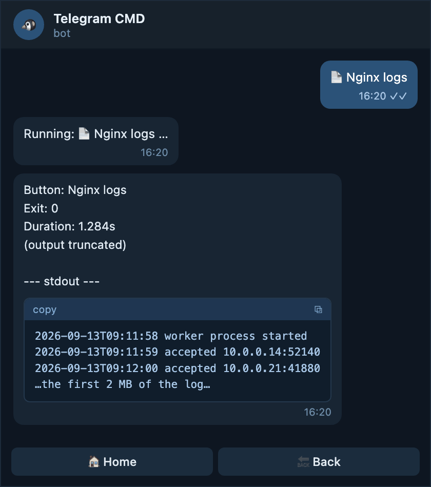{ .shot loading=lazy }

    </div>
    </div>

!!! tip "Raising it only helps if a file is sent"

    A chat message can never carry more than 4096 bytes, so a bigger
    `max_output_bytes` only reaches you in full when the result arrives as a
    `.txt` file. Pair it with `output: auto` (the default) or `output: file`.

## :material-tune: `output`

`output` chooses the delivery. It accepts three values, and it is the only
output field you can also put on a single button.

=== "auto"

    Text messages while the result is short, one `.txt` file when it is not.
    This is the default, and the value you keep if you write nothing.

    <div class="result" markdown>
    <div class="result-text" markdown>

    !!! example "Let the bot pick for every result"

        ```yaml title="config.yaml"
        shell: /bin/bash
        timeout: 60s
        output: auto # (1)!
        max_output_messages: 2 # (2)!
        ```

        1.  Decide per result instead of forcing one delivery.
        2.  The switching point. Two messages or fewer stay in the chat;
            anything longer becomes one file.

    </div>
    <div class="result-shot" markdown>

    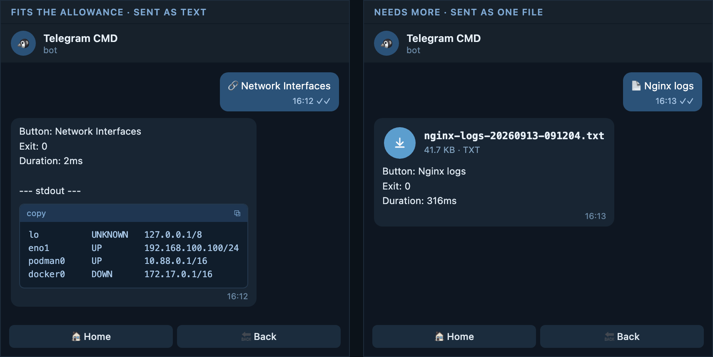{ .shot .shot--wide loading=lazy }

    </div>
    </div>

=== "text"

    Always chat messages, however long the result is. The bot stops after ten
    messages and adds a note that the rest was cut.

    <div class="result" markdown>
    <div class="result-text" markdown>

    !!! example "Keep everything in the chat"

        ```yaml title="config.yaml"
        shell: /bin/bash
        timeout: 60s
        output: text # (1)!
        ```

        1.  `max_output_messages` is ignored here, because the bot never
            switches to a file on its own.

    </div>
    <div class="result-shot" markdown>

    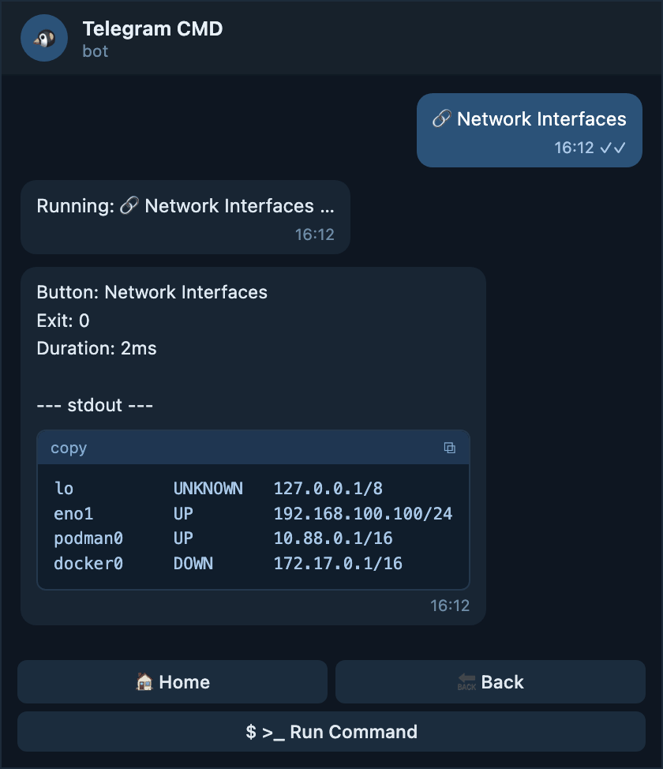{ .shot loading=lazy }

    </div>
    </div>

=== "file"

    Always one `.txt` file, even for a one-line result. The summary comes along
    as the file caption.

    <div class="result" markdown>
    <div class="result-text" markdown>

    !!! example "Send every result as an attachment"

        ```yaml title="config.yaml"
        shell: /bin/bash
        timeout: 60s
        output: file # (1)!
        ```

        1.  Every button sends an attachment now, including the quick ones.
            Put this on single buttons instead if that is too much.

    </div>
    <div class="result-shot" markdown>

    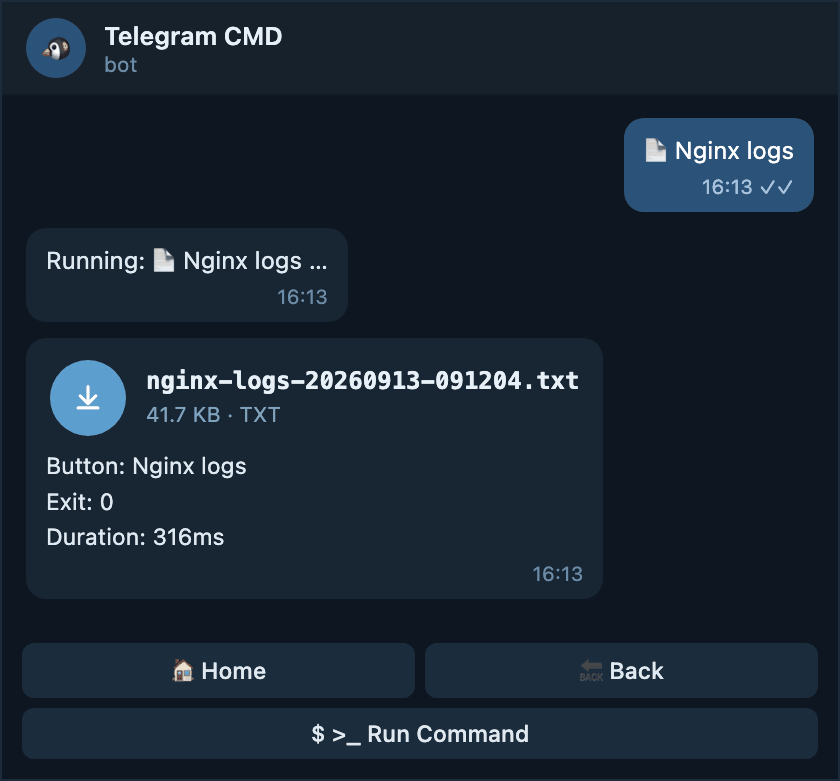{ .shot loading=lazy }

    </div>
    </div>

!!! note "Omitting it is the same as writing `auto`"

    You never have to write `output`. A config that worked before this field
    existed keeps behaving exactly the same.

## :material-counter: `max_output_messages`

This field only matters in `auto` mode, and it only exists at the root. It is
the number of chat messages the bot is willing to send before it gives up on
messages and sends one file instead. Allowed values are `1` to `10`; the
default is `2`.

!!! example "Send a file as soon as the result needs a second message"

    ```yaml title="config.yaml"
    output: auto
    max_output_messages: 1 # (1)!
    ```

    1.  The strictest setting. Only a result that fits in one message stays in
        the chat.

!!! success "What you get in the chat"

    <div class="result" markdown>
    <div class="result-text" markdown>

    A result that fits inside the allowance stays as chat messages. The moment
    it would need one message more, the whole result arrives as a single `.txt`
    file instead, and no partial messages are sent.

    </div>
    <div class="result-shot" markdown>

    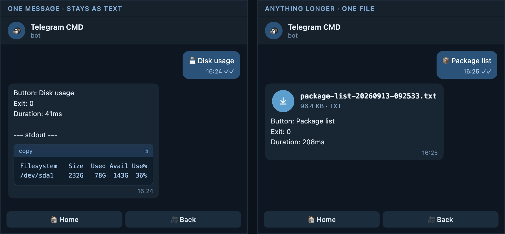{ .shot .shot--wide loading=lazy }

    </div>
    </div>

!!! warning "It is a root-only field"

    A button cannot set `max_output_messages`. Put it at the root and let
    buttons that need something different set `output: text` or `output: file`.

## :material-table-arrow-right: Root and button together

A button may carry its own `output`. Nothing else about output is settable per
button. The effective mode is simply:

!!! abstract "How the effective mode is chosen"

    ```text title="Order of precedence"
    button output  →  root output  →  auto
    ```

| Root `output` | Button `output` | What actually happens |
|---------------|-----------------|-----------------------|
| not set or `auto` | not set | `auto` |
| not set or `auto` | `auto` | `auto` |
| not set or `auto` | `text` | `text` |
| not set or `auto` | `file` | `file` |
| `text` | not set | `text` |
| `text` | `auto` | `auto` |
| `text` | `text` | `text` |
| `text` | `file` | `file` |
| `file` | not set | `file` |
| `file` | `auto` | `auto` |
| `file` | `text` | `text` |
| `file` | `file` | `file` |

The sections below walk through all twelve combinations, one example each.

## :material-numeric-1-box-outline: When the root is `auto`

This includes the case where the root says nothing at all, because a missing
`output` means `auto`.

### The root is `auto`, the button says nothing

The everyday case. Short results stay in the chat; a result that would need
more than `max_output_messages` messages arrives as a file.

!!! example "A plain button under a plain root"

    ```yaml title="config.yaml"
    output: auto
    max_output_messages: 2

    menu:
      - name: Disk usage
        type: button
        function: command
        command: "df -h"
    ```

!!! success "What you get in the chat"

    <div class="result" markdown>
    <div class="result-text" markdown>

    `df -h` prints a handful of lines, so it fits in one message and stays in
    the chat as a code block with the summary above it.

    </div>
    <div class="result-shot" markdown>

    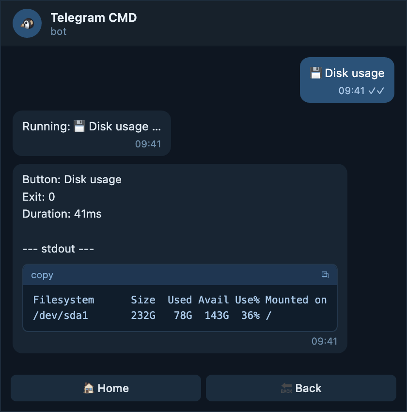{ .shot loading=lazy }

    </div>
    </div>

### The root is `auto`, the button says `auto`

Writing `auto` on the button changes nothing here. It is only worth typing when
you want the button to stay in `auto` no matter what the root becomes later.

!!! example "Spelling out the default on the button"

    ```yaml title="config.yaml"
    output: auto

    menu:
      - name: Disk usage
        type: button
        function: command
        command: "df -h"
        output: auto # (1)!
    ```

    1.  Same behaviour as leaving it out today, but this button keeps it even
        if the root changes to `text` or `file` later.

!!! success "What you get in the chat"

    <div class="result" markdown>
    <div class="result-text" markdown>

    Exactly the automatic behaviour: text while the result is short, one file
    once it grows past the allowance. On a server with many mounted disks the
    very same button can send you a file instead.

    </div>
    <div class="result-shot" markdown>

    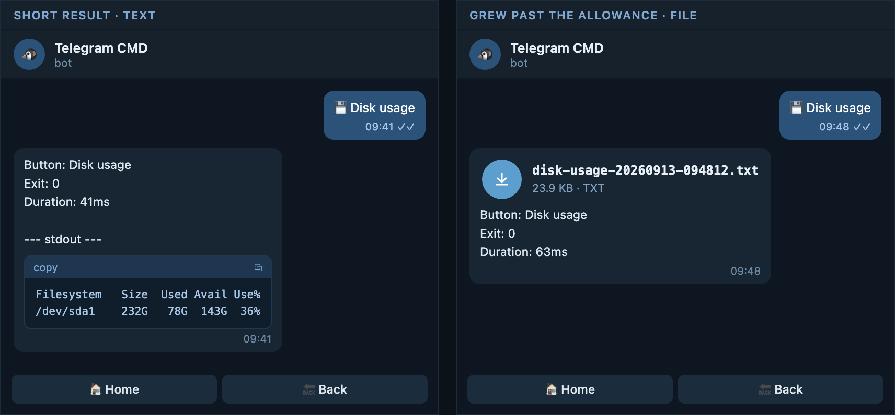{ .shot .shot--wide loading=lazy }

    </div>
    </div>

### The root is `auto`, the button says `text`

Use this for a button whose output you always want to read inline, even when it
runs a little long — a status list you scroll through rather than download.

!!! example "Keep one button in the chat"

    ```yaml title="config.yaml"
    output: auto

    menu:
      - name: Service status
        type: button
        function: command
        command: "systemctl status nginx --no-pager"
        output: text # (1)!
    ```

    1.  Never a file, whatever `max_output_messages` says.

!!! success "What you get in the chat"

    <div class="result" markdown>
    <div class="result-text" markdown>

    The result is split into several messages, each one a reply to the message
    before it, so the order is never lost. The buttons stay on the last part.

    </div>
    <div class="result-shot" markdown>

    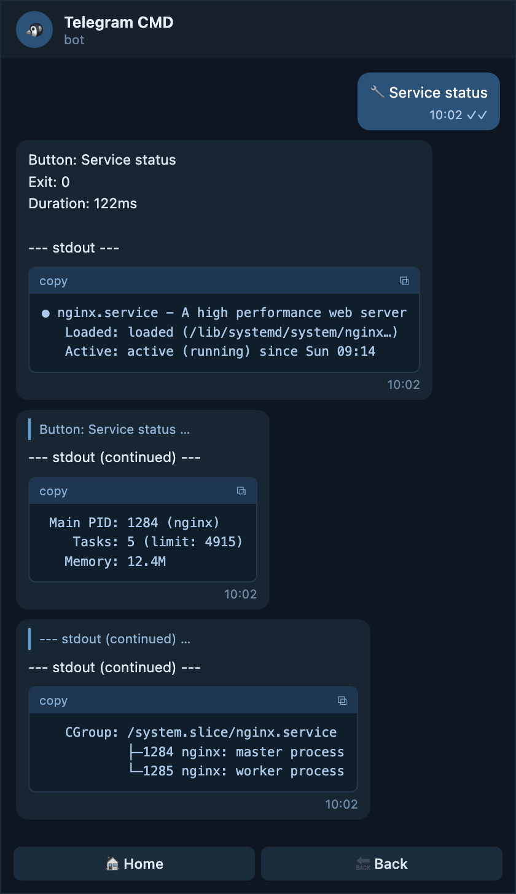{ .shot loading=lazy }

    </div>
    </div>

### The root is `auto`, the button says `file`

The typical choice for logs and backups: you almost never want to read them in
the chat, and a file is easier to keep.

!!! example "Always download this one"

    ```yaml title="config.yaml"
    output: auto

    menu:
      - name: Nginx logs
        type: button
        function: command
        command: "journalctl -u nginx -n 2000 --no-pager"
        output: file # (1)!
    ```

    1.  The rest of the menu still behaves automatically. Only this button is
        pinned to a file.

!!! success "What you get in the chat"

    <div class="result" markdown>
    <div class="result-text" markdown>

    One attachment with the button name, exit code, and duration as its
    caption. Tap it to read the whole log, or keep it for later.

    </div>
    <div class="result-shot" markdown>

    { .shot loading=lazy }

    </div>
    </div>

## :material-numeric-2-box-outline: When the root is `output: text`

Every button stays in the chat unless it says otherwise. Pick this when you
dislike downloading files on your phone.

### The root is `text`, the button says nothing

!!! example "Chat messages everywhere"

    ```yaml title="config.yaml"
    output: text

    menu:
      - name: Uptime
        type: button
        function: command
        command: "uptime"
    ```

!!! success "What you get in the chat"

    <div class="result" markdown>
    <div class="result-text" markdown>

    One short message, because `uptime` prints a single line. Longer results
    are simply split into more messages, up to ten.

    </div>
    <div class="result-shot" markdown>

    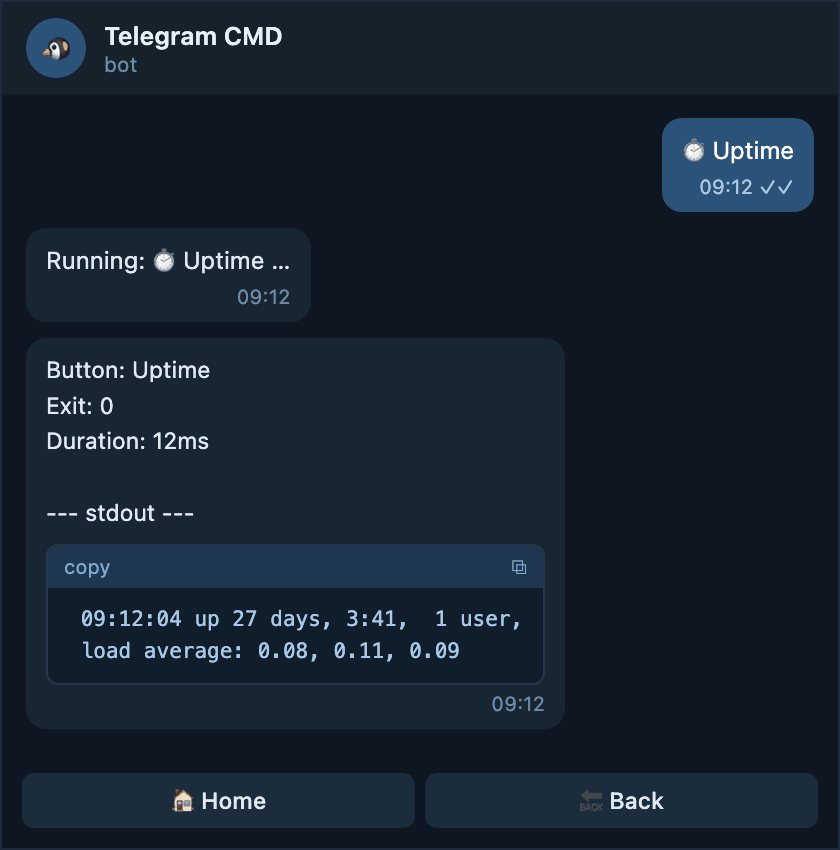{ .shot loading=lazy }

    </div>
    </div>

### The root is `text`, the button says `auto`

The button opts back in to the automatic switch, so this one button may send a
file even though the rest of the menu never does. `max_output_messages` from
the root decides where the switch happens.

!!! example "One button allowed to send a file when it gets long"

    ```yaml title="config.yaml"
    output: text
    max_output_messages: 3 # (1)!

    menu:
      - name: Package list
        type: button
        function: command
        command: "dpkg -l"
        output: auto
    ```

    1.  Only this button reads the allowance, because it is the only one in
        `auto` mode.

!!! success "What you get in the chat"

    <div class="result" markdown>
    <div class="result-text" markdown>

    A short package list arrives as up to three messages. On a full server the
    same button crosses the allowance and sends one file instead.

    </div>
    <div class="result-shot" markdown>

    { .shot .shot--wide loading=lazy }

    </div>
    </div>

### The root is `text`, the button says `text`

Same as saying nothing, but the intent is written down. Useful in a long config
where you do not want a later edit at the root to change this button.

!!! example "Pinning a button to chat messages"

    ```yaml title="config.yaml"
    output: text

    menu:
      - name: Last logins
        type: button
        function: command
        command: "last -n 20"
        output: text
    ```

!!! success "What you get in the chat"

    <div class="result" markdown>
    <div class="result-text" markdown>

    Always chat messages, up to ten of them, whatever the root is changed to
    later.

    </div>
    <div class="result-shot" markdown>

    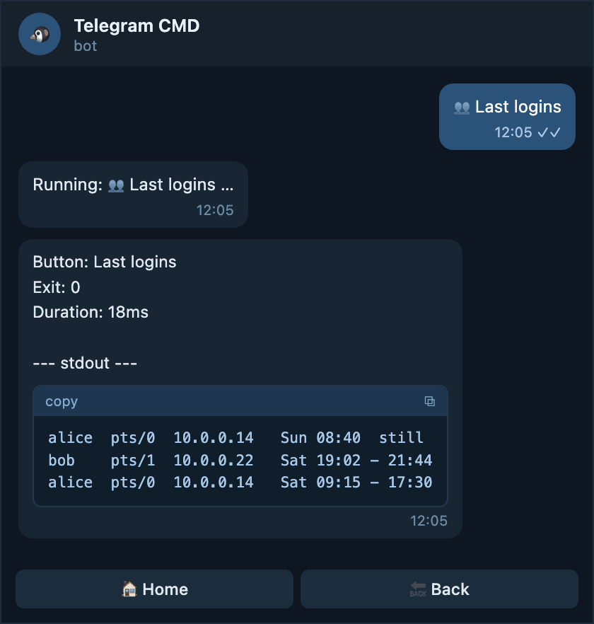{ .shot loading=lazy }

    </div>
    </div>

### The root is `text`, the button says `file`

!!! example "One downloadable button in a chat-only menu"

    ```yaml title="config.yaml"
    output: text

    menu:
      - name: Full system report
        type: button
        function: command
        command: "/usr/local/bin/report.sh"
        output: file
        timeout: "5m" # (1)!
    ```

    1.  A report can take a while, so this button gets longer than the global
        timeout.

!!! success "What you get in the chat"

    <div class="result" markdown>
    <div class="result-text" markdown>

    The only attachment in an otherwise chat-only menu. The caption shows how
    long the report took, which is useful when it runs for minutes.

    </div>
    <div class="result-shot" markdown>

    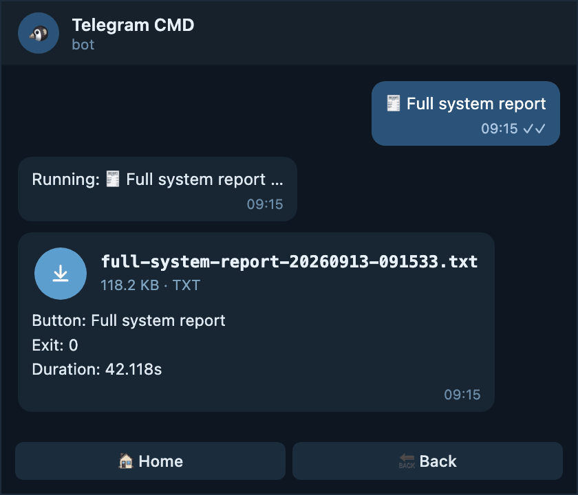{ .shot loading=lazy }

    </div>
    </div>

## :material-numeric-3-box-outline: When the root is `output: file`

Every result is a file, even a one-line one. This suits a bot used mostly for
reports and archives.

### The root is `file`, the button says nothing

!!! example "Files everywhere"

    ```yaml title="config.yaml"
    output: file

    menu:
      - name: Uptime
        type: button
        function: command
        command: "uptime"
    ```

!!! success "What you get in the chat"

    <div class="result" markdown>
    <div class="result-text" markdown>

    Even a single line of output arrives as an attachment. The caption still
    carries the summary, so you can read the exit code without opening it.

    </div>
    <div class="result-shot" markdown>

    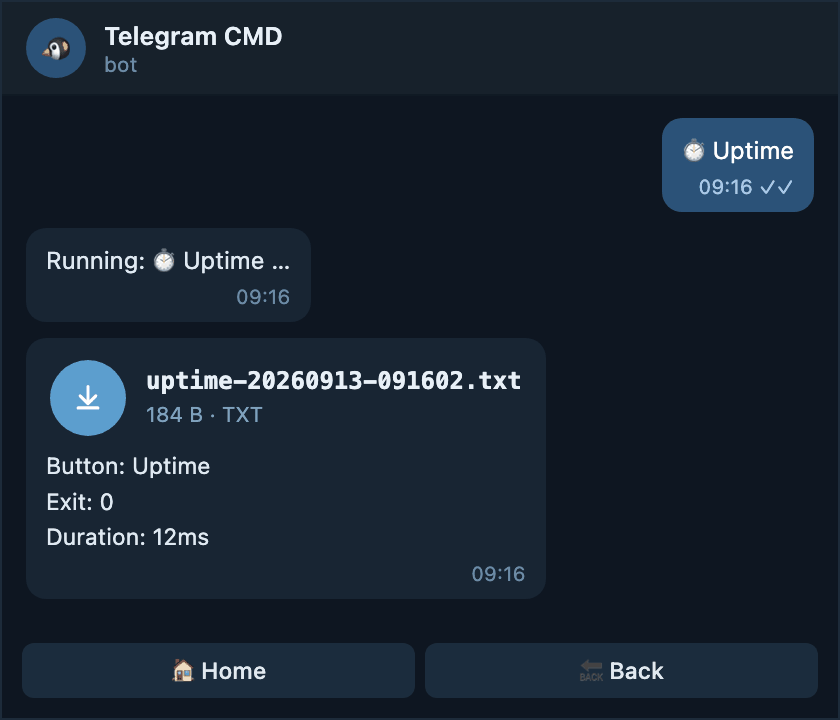{ .shot loading=lazy }

    </div>
    </div>

!!! warning "Even tiny results become downloads"

    A one-line answer arrives as an attachment you have to open. If that annoys
    you, leave the root on `auto` and put `output: file` only on the buttons
    that need it.

### The root is `file`, the button says `auto`

The button escapes the file-only rule and behaves normally again.

!!! example "Let a quick check stay readable"

    ```yaml title="config.yaml"
    output: file
    max_output_messages: 2

    menu:
      - name: Uptime
        type: button
        function: command
        command: "uptime"
        output: auto # (1)!
    ```

    1.  Back to the automatic switch for this button only.

!!! success "What you get in the chat"

    <div class="result" markdown>
    <div class="result-text" markdown>

    The one-line answer is short, so it stays in the chat as a message while
    every other button in the menu still sends files.

    </div>
    <div class="result-shot" markdown>

    { .shot loading=lazy }

    </div>
    </div>

### The root is `file`, the button says `text`

!!! example "Force one button back into the chat"

    ```yaml title="config.yaml"
    output: file

    menu:
      - name: Who is logged in
        type: button
        function: command
        command: "who"
        output: text
    ```

!!! success "What you get in the chat"

    <div class="result" markdown>
    <div class="result-text" markdown>

    A message, never an attachment, however long the list of logged in users
    grows. Above ten messages the bot notes that the rest was cut.

    </div>
    <div class="result-shot" markdown>

    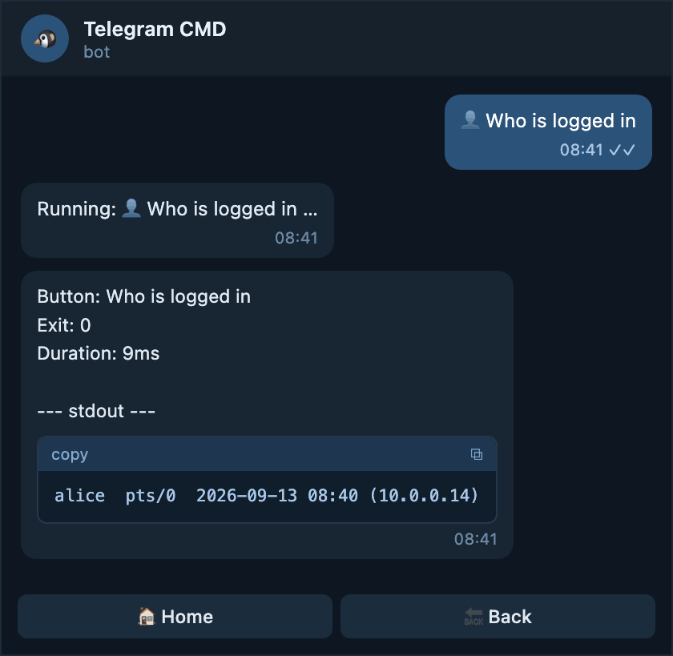{ .shot loading=lazy }

    </div>
    </div>

### The root is `file`, the button says `file`

Repeating the root value. Harmless, and it keeps the button correct if you
relax the root later.

!!! example "A button that must always be a file"

    ```yaml title="config.yaml"
    output: file

    menu:
      - name: Database dump log
        type: button
        function: command
        command: "cat /var/log/pg_dump.log"
        output: file
    ```

!!! success "What you get in the chat"

    <div class="result" markdown>
    <div class="result-text" markdown>

    An attachment, exactly as the root already asked for. Writing it on the
    button makes the intent survive a change at the root.

    </div>
    <div class="result-shot" markdown>

    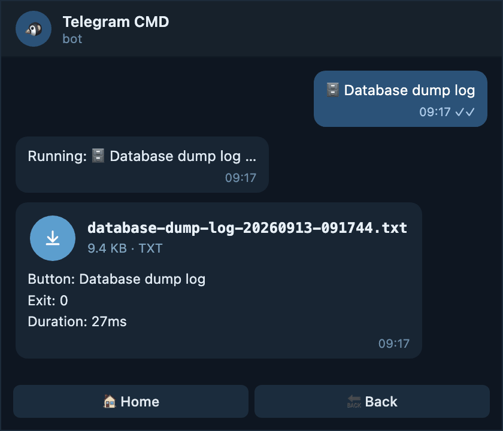{ .shot loading=lazy }

    </div>
    </div>

## :material-file-document-outline: What the file looks like

When a result is delivered as a file, you get one attachment plus a short
caption.

- **Name** — the button name in lowercase with dashes, then the date and time
  in UTC, for example `nginx-logs-20260913-091204.txt`.
- **Caption** — the same summary you would see at the top of a chat message:
  button name, exit code, duration, and the timeout or truncation note when
  there is one.
- **Body** — that summary again, then a `--- stdout ---` section, then a
  `--- stderr ---` section when the command wrote anything to it.

!!! success "Inside the downloaded file"

    ```text title="nginx-logs-20260913-091204.txt"
    Button: Nginx logs
    Exit: 0
    Duration: 316ms

    --- stdout ---
    2026-09-13T09:11:58 nginx: worker process started
    ...

    --- stderr ---
    2026-09-13T09:12:01 nginx: warning: duplicate server name
    ```

## :material-alert-outline: Limits you cannot change

!!! warning "Telegram sets the ceiling, not the bot"

    - One chat message holds at most 4096 bytes.
    - In `text` mode the bot sends at most ten messages and ends with
      `(output too long; showing first N bytes)`.
    - Whatever `max_output_messages` you write, ten messages is still the hard
      ceiling.

!!! note "If the upload fails, you still get the result"

    When the file cannot be sent — no network, Telegram refusing it — the bot
    falls back to chat messages so the result is not lost.

## :material-console: Run Command uses the root setting

The **`$ >_ Run Command`** button is not part of your menu, so it has no
`output` of its own. It always follows the root `output` and
`max_output_messages`. See [Menu → Run Command](concepts/menu.md#run-command).

## :material-link-variant: Related

<div class="grid cards cols-2" markdown>

-   :material-cog-outline:{ .middle } __Configuration__

    ---

    Every root key, including the three output fields in one table.

    [:octicons-arrow-right-24: Configuration](configuration.md#root-fields)

-   :material-gesture-tap-button:{ .middle } __Button__

    ---

    What a button can override, `output` among them.

    [:octicons-arrow-right-24: Button](concepts/button.md)

-   :material-view-list:{ .middle } __Menu__

    ---

    How results sit next to the menu, and what Run Command does.

    [:octicons-arrow-right-24: Menu](concepts/menu.md)

-   :material-timer-outline:{ .middle } __Shell__

    ---

    The shell, working directory, and timeout your commands run with.

    [:octicons-arrow-right-24: Shell](concepts/shell.md)

</div>
