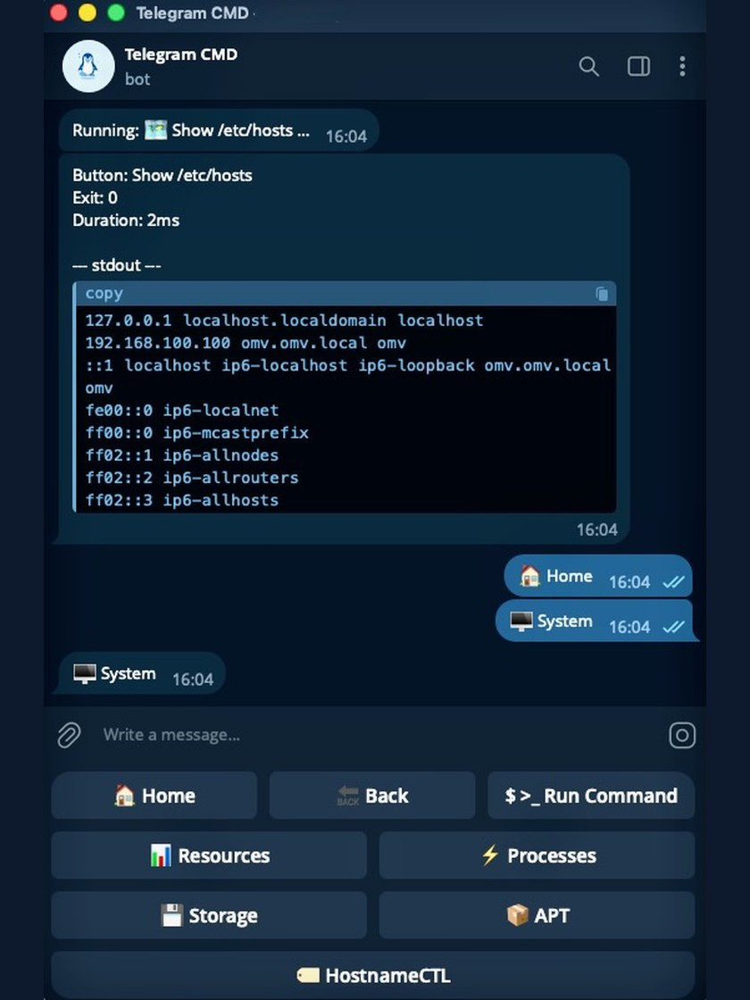
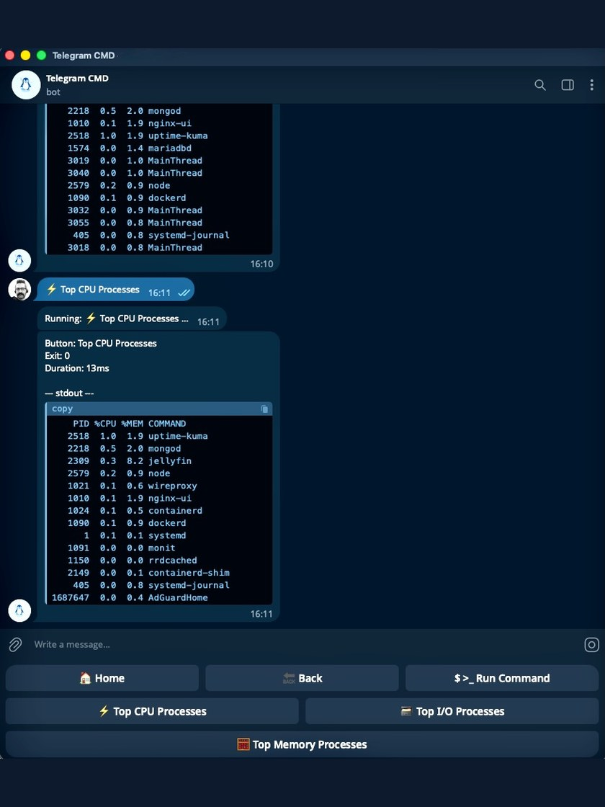
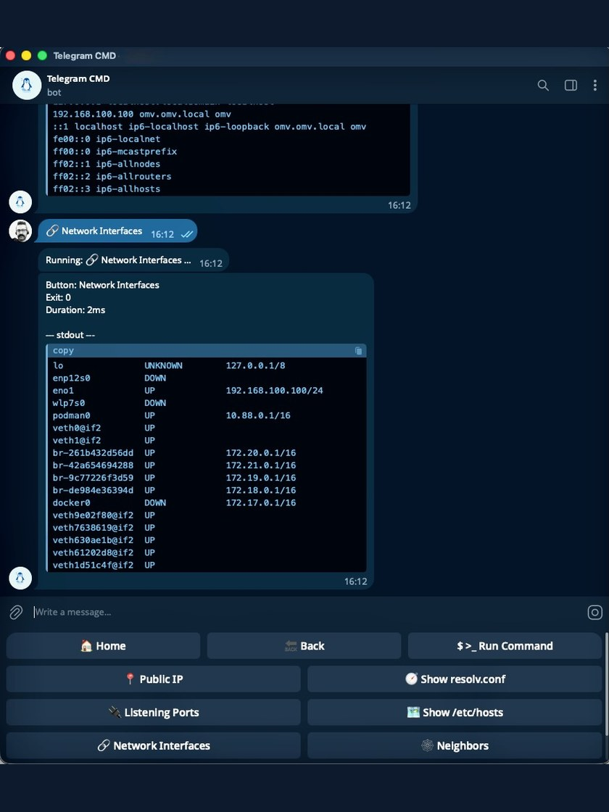
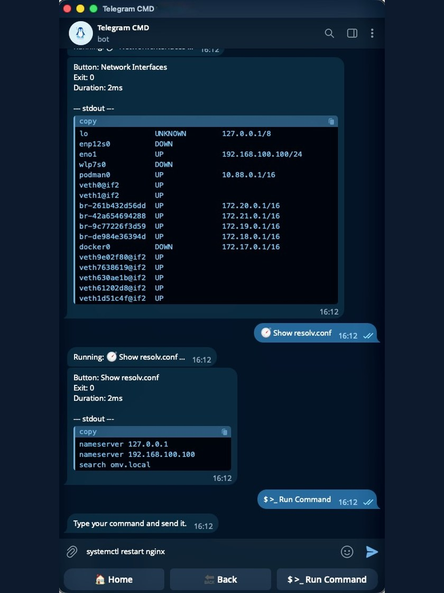
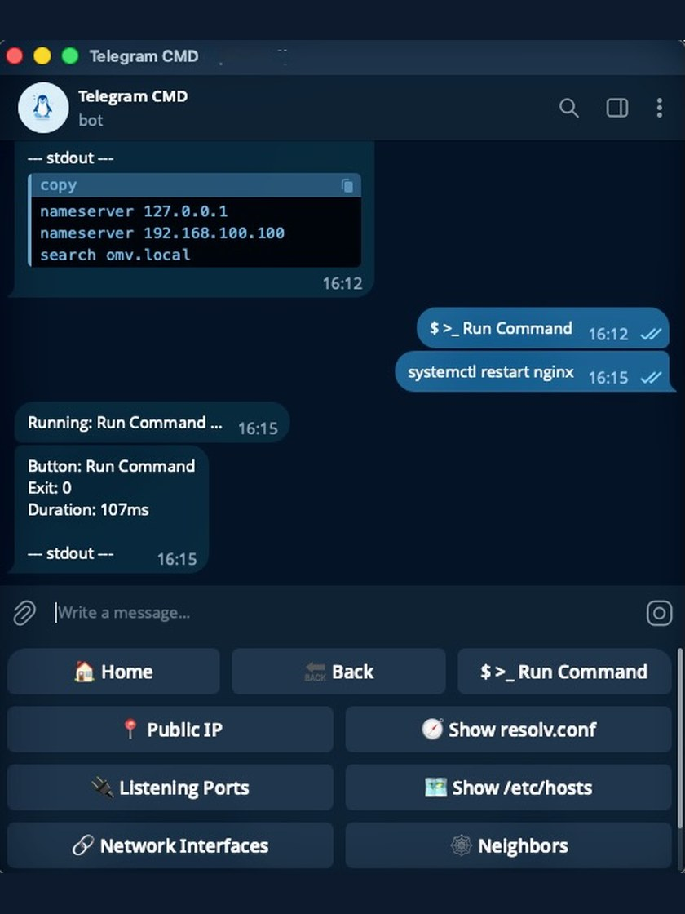

# :material-cellphone-link: Control your Linux server from Telegram

<div class="hero" markdown>
<div class="hero-art" markdown>
{ .off-glb width="230" }
</div>
<div class="hero-text" markdown>
**One tap runs a command on your server and sends the output back to your chat.**

Telegram Commander turns a simple YAML [config file](documentation/concepts/config-file.md)
into a Telegram bot with a menu of [buttons](documentation/concepts/button.md). Put any
terminal command behind a button and run it from your phone. You do not write any code.
</div>
</div>

<div style="text-align: center" markdown="span">
[Get started :material-arrow-right:](documentation/installation/download-and-run.md){ .md-button .md-button--primary }
[See a config :material-file-code-outline:](documentation/configuration.md#a-minimal-config){ .md-button }
</div>

[Installation](documentation/installation/download-and-run.md) ·
[Concepts](documentation/concepts/config-file.md) ·
[Functions](documentation/functions/index.md) ·
[Configuration](documentation/configuration.md) ·
[CLI](documentation/cli.md)

## :material-image-multiple-outline:{ .shots } Screenshots { .split }

Your menu, a command running, the output that comes back, and typing a command
by hand. Click any picture to see it full size.

<div style="text-align: center" markdown="span">
  { width="140" loading=lazy }
  { width="140" loading=lazy }
  { width="140" loading=lazy }
  { width="140" loading=lazy }
  { width="140" loading=lazy }
</div>

## :material-lightning-bolt:{ .bolt } Quick and easy { .split }

<div class="grid cards cols-3 center-title step-cards" markdown>

-   :material-file-document-outline:{ .middle } __Write your menu__

    ---

    :material-numeric-1-circle:{ .step } List the buttons and their commands.

-   :material-rocket-launch:{ .middle } __Start the bot__

    ---

    :material-numeric-2-circle:{ .step } Run it now, or keep it up as a
    service.

-   :material-gesture-tap-button:{ .middle } __Tap and read__

    ---

    :material-numeric-3-circle:{ .step } Tap a button and read the output in
    the chat.

</div>

<div style="text-align: center" markdown="span">
[Start now :material-rocket-launch-outline:](documentation/installation/download-and-run.md){ .md-button .md-button--primary }
</div>

## :material-view-grid-outline:{ .grid-icon } Use cases { .split }

<div class="grid cards cols-4 icon-left" markdown>

-   :material-restart:{ .lg } Restart or stop a service
-   :material-docker:{ .lg } Start and stop containers
-   :material-package-down:{ .lg } Update system packages
-   :material-text-box-search-outline:{ .lg } Read logs and journals
-   :material-harddisk:{ .lg } Check disk space
-   :material-memory:{ .lg } Watch CPU and memory
-   :material-access-point-network:{ .lg } Ping hosts and test URLs
-   :material-backup-restore:{ .lg } Take and restore backups
-   :material-script-text:{ .lg } Run your own scripts
-   :material-power:{ .lg } Reboot or shut down the host
-   :material-console:{ .lg } Type any command by hand
-   :material-all-inclusive:{ .lg } And almost anything else

</div>

## :material-thumb-up-outline:{ .thumb } Why use it { .split }

<div class="grid cards cols-4 center-title" markdown>

-   :material-clock-fast:{ .lg .middle } __No coding__

    ---

    Describe the menu and commands in one YAML file.

    [:octicons-arrow-right-24: Config file](documentation/concepts/config-file.md)

-   :material-cellphone-link:{ .lg .middle } __From anywhere__

    ---

    Open Telegram on your phone and run the server. No VPN into the host.

    [:octicons-arrow-right-24: How the bot connects](documentation/concepts/long-polling.md)

-   :material-lan-disconnect:{ .lg .middle } __No open ports__

    ---

    The bot connects out to Telegram. Nothing is exposed to the internet.

    [:octicons-arrow-right-24: How the bot connects](documentation/concepts/long-polling.md)

-   :material-message-text-outline:{ .lg .middle } __Output in the chat__

    ---

    The result comes back as a message. You do not need an SSH session.

    [:octicons-arrow-right-24: How much output you see](documentation/configuration.md#how-much-command-output-you-see)

-   :material-shield-lock:{ .lg .middle } __Controlled and recorded__

    ---

    Choose who gets the menu, confirm risky actions, and record each run.

    [:octicons-arrow-right-24: Access and confirmation](documentation/concepts/allowed-users.md)

-   :material-folder-outline:{ .lg .middle } __Nested menus__

    ---

    Group buttons into categories. Home stays at the top; Back takes you up.

    [:octicons-arrow-right-24: Menu](documentation/concepts/menu.md)

-   :material-function-variant:{ .lg .middle } __Reusable functions__

    ---

    Write a command once, then fill in different values on each button.

    [:octicons-arrow-right-24: Functions](documentation/functions/index.md)

-   :material-cog-play-outline:{ .lg .middle } __Stays running__

    ---

    Install it as a service and the bot starts with the host.

    [:octicons-arrow-right-24: Run as a service](documentation/installation/run-as-a-service.md)

</div>

## :material-file-code-outline:{ .code-icon } A tiny example { .split }

This config makes a bot with one button called "Uptime". Tapping it runs the
`uptime` command on the server.

!!! example "This complete config adds one button"

    ```yaml title="config.yaml"
    telegram:
      bot_token: "YOUR_BOT_TOKEN" # (1)!
      allowed_users:
        - "YOUR_USER_ID" # (2)!

    menu:
      - name: Uptime
        type: button
        function: command
        command: "uptime" # (3)!
    ```

    1.  Ask BotFather in Telegram for a token when you create the bot.
    2.  Only the accounts listed here can open the menu. You can use a numeric id
        or an `@username`.
    3.  Anything you could type in a terminal goes here.

That is a complete, working configuration. Everything else is optional.

!!! tip "Built for a small, trusted group"

    Nothing listens for incoming connections, and only the accounts in
    `allowed_users` get a menu. Everyone who can use the bot can run the
    buttons you defined, so keep that list short.

## :material-hand-pointing-right: Ready to try it? { .split }

<div style="text-align: center" markdown>
[Start now :material-rocket-launch-outline:](documentation/installation/download-and-run.md){ .md-button .md-button--primary }
[Concepts :material-book-open-variant:](documentation/concepts/config-file.md){ .md-button }
[Latest release :material-download:](https://github.com/azolfagharj/telegram-commander/releases/latest){ .md-button .md-button--primary }

[Browse the source :fontawesome-brands-github:](https://github.com/azolfagharj/telegram-commander){ .md-button }
</div>

Telegram Commander is free and open source. If it saves you time,
[consider supporting its development](https://azolfagharj.github.io/donate/) —
it helps keep the project alive and maintained.
